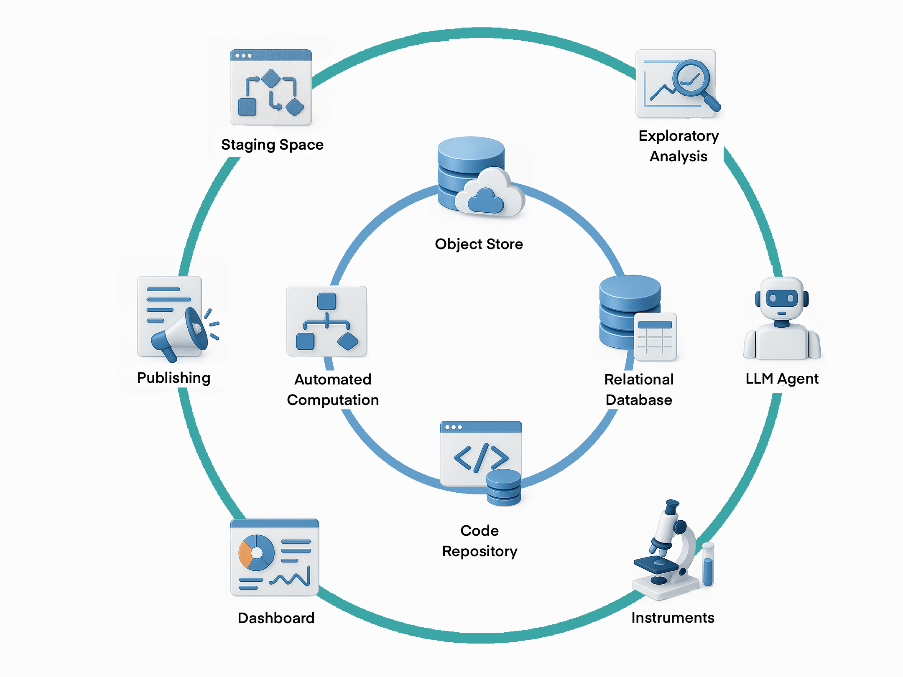

# DataJoint Specs

* Version: 2.0
* Status: Accepted 2025-06-01
* Authors:
  * [Dimitri Yatsenko](https://github.com/dimitri-yatsenko)
* Implements DSEPs:
  * None
* Description: First release of DataJoint Specs. Versioning starts with 2.0 to stay ahead of current implementations, although implementation versions are independent of the specs versions.

---
# License

This DataJoint Specification document is licensed under the **Creative Commons Attribution-ShareAlike 4.0 International License (CC BY-SA 4.0)**.

<a rel="license" href="http://creativecommons.org/licenses/by-sa/4.0/"></a>

You are free to:

* **Share** — copy and redistribute the material in any medium or format
* **Adapt** — remix, transform, and build upon the material
    for any purpose, even commercially.

Under the following terms:

* **Attribution (BY)** — You must give appropriate credit, provide a link to the license, and indicate if changes were made. You may do so in any reasonable manner, but not in any way that suggests the licensor endorses you or your use.
* **ShareAlike (SA)** — If you remix, transform, or build upon the material, you must distribute your contributions under the same license as the original.

This license is available at: [http://creativecommons.org/licenses/by-sa/4.0/](http://creativecommons.org/licenses/by-sa/4.0/)

---
# Introduction

## Purpose of DataJoint Specs

The **DataJoint Specs** define the **standards, conventions, and best practices** for designing and managing **DataJoint pipelines**. These specifications ensure that all DataJoint implementations remain **consistent, scalable, and interoperable** across various scientific workflows and computing environments.

By following the **DataJoint Specs**, users and developers can:
- Maintain **structured, reproducible data pipelines**.
- Ensure **compatibility across different DataJoint implementations**.
- Adopt **best practices** for **schema design, data integrity, and computational workflows**.
- Provide a **foundation for future enhancements** while preserving backward compatibility.

---

## Purpose of DataJoint

**DataJoint provides scientists with enhanced capabilities to design, implement, and manage the data operations underpinning their research**.

At its core, **DataJoint treats data and computations jointly within a formal _computational database_**, unifying data structures and analysis code. It extends the traditional relational data model so that some tables contain raw or curated input data, while others define computations and store their results. This makes it possible to precisely construct and express entire scientific workflows—data acquisition, transformation, analysis—as structured, executable pipelines.

In this architecture, the database becomes more than just a storage system; it evolves into a **living pipeline** that encodes the logic and lineage of scientific work:

* **Structured**: with explicit schema and clear data relationships
* **Scalable**: supporting high-throughput, high-dimensional experimental data
* **Reproducible**: with every step recorded, auditable, and rerunnable

DataJoint maintains the rigor of relational databases—ensuring **data integrity, ACID-compliant transactions, and declarative query logic**—but extends their scope to meet the demands of modern science:

* **Computations become first-class citizens** in the schema, tied to data via dependency graphs
* **Complex scientific data types** (e.g., multidimensional arrays, images, time series) are modeled and managed through configurable extensions
* Data pipelines are encoded explicitly, enabling automation, parallelism, and long-term reproducibility

This structured approach enables researchers to pursue ambitious goals, achieve engineered reliability, and build, refine, and share robust workflow systems.

By unifying computational logic and relational data modeling, **DataJoint provides a foundation for building high-integrity, high-performance scientific data ecosystems.**

## Open-Source Development and the DataJoint Standard

DataJoint is defined by an **open standard** designed to ensure interoperability and compatibility across different implementations and scientific workflows.
Aligned with Open Science principles, this standard focuses on the **core components** that form the foundation of any DataJoint pipeline, often visualized as the inner circle in the architectural diagram below.


*Diagram illustrating the core components defined by the DataJoint standard (inner circle) and the broader ecosystem integration points (outer circle).*

These **core components**, covered by these specifications, include:

* **Code Repository (e.g., Git):** A dedicated version-controlled repository houses each pipeline, including the pipeline definition (schemas, table classes), analysis code, configuration settings, and potentially containerized environments. It serves as the central hub for managing pipeline development, ensuring collaborative development and reproducibility by linking computations to specific code versions.
* **Relational Database (e.g., MySQL, PostgreSQL):** Serves as the pipeline's metadata store and system of record. It ensures structured tabular storage for experiment data, metadata, and results, enforces data integrity and traceability via foreign-key relationships, and maintains consistency through ACID-compliant transactions.
* **Computational Dependencies:** The encoded logic defining data flow and linking data stages to specific analysis code within the database structure, enabling automation and reproducibility. This transforms the database into a computational engine.
* **Object Store (Optional but common; e.g., Filesystem, S3, GCS, Azure Blob):** A scalable storage backend for managing large scientific datasets (e.g., images, neural recordings, videos) referenced in the relational database but stored externally. This hybrid storage model keeps the database efficient while enabling management of large data objects, often using structured key-naming conventions.

These **DataJoint Specs** primarily define this **core framework** and its principles, ensuring that pipelines built using different tools or platforms remain consistent and interoperable. Adherence to this standard is fundamental for achieving data integrity, automated computation, reproducibility, collaboration, and integrated multi-modal data handling.

The current reference implementation for this standard is the open-source **DataJoint-Python library** [`datajoint-python`](https://github.com/datajoint/datajoint-python), available under the [Apache 2.0 License](https://github.com/datajoint/datajoint-python/discussions/1235). It provides the essential tools for research teams to build, manage, and integrate their own pipelines using the DataJoint standard.

While the standard defines the core, a fully operational scientific pipeline often integrates with a broader **ecosystem** (e.g., specific instruments, ELNs, job orchestrators, visualization tools – the outer circle in the diagram). These **ecosystem integration points** may include:

* **Job Orchestration:** Systems for scheduling, executing, distributing, and monitoring computational jobs (e.g., DataJoint Compute Service, custom scripts, Airflow, SLURM, Kubernetes).
* **Web Interfaces, APIs, and System Integrations:** Tools for interactive data exploration, visualization, data entry (e.g., custom dashboards, JupyterHub), and integration with external systems (ELNs, LIMS, instruments).

While these extensions build upon the core framework, they are generally **outside the scope of the base DataJoint specification**, allowing flexibility and choice in implementation.
Various DIY implementations and commercial offerings may diverge in implementing such extensions.

## The DataJoint Platform (not covered by the specs or open standard)

For research teams seeking a **fully managed, turnkey solution**, [DataJoint Inc.](https://datajoint.com) offers its **Data Operations Platform for Scientific Research**.
This commercial platform is built *upon* the **open-source core and standards** described previously but adds integrated components and services to simplify deployment and reduce operational overhead.

The platform provides a cohesive infrastructure designed to enhance operational excellence in data-intensive research, typically including:

* **Hosted and managed databases**
* **Integrated, scalable object storage**
* **Automated computation and job orchestration services**
* **Web-based tools** for data exploration, visualization, and collaboration
* **Integration with AI Assistants / LLM agents** to potentially assist with tasks like querying, analysis suggestions, or documentation.
* **Enterprise support, consulting, and training**
* **Pre-integrated functional components** (e.g., standard pipelines via the [DataJoint Elements](https://docs.datajoint.com/elements/) program)
* **Security, compliance, and access control management**

The **DataJoint Platform** aims to provide a **reliable, scalable, and secure environment** for large-scale scientific workflows, deployable **on-premise, in the cloud, or in a hybrid infrastructure**.

Crucially, while leveraging the platform's managed services, research teams **retain full ownership and control over their pipeline code and scientific data**.
This ensures that choosing between a DIY approach with the open-source tools or partnering with DataJoint Inc. for the commercial platform maintains data sovereignty and allows for flexibility and interoperability, grounded in the common DataJoint standard.

---

## Key Objectives and Design Principles

The DataJoint standard is designed around the following key objectives and principles to support robust and scalable scientific data workflows:

* **Unified Data and Computation:** Extend the relational model to a *computational database*, seamlessly integrating data storage with computational logic and dependencies.
* **Data Integrity and Reliability:** Enforce data validity, consistency, and correctness through rigorous relational database principles, including primary keys, foreign keys, constraints, and ACID-compliant transactions.
* **Guaranteed Reproducibility:** Ensure computations are traceable and reproducible by design, linking results to the exact data, parameters, and code versions used in their generation.
* **Automation of Computation:** Enable intelligent and automated execution of computational steps based on data availability and predefined dependencies.
* **Seamless Collaboration:** Provide a structured, shared "single source of truth" through a common database schema, facilitating concurrent work and consistent data access for teams.
* **Powerful and Flexible Querying:** Leverage the relational model to enable sophisticated and efficient querying of complex datasets based on any recorded attribute.
* **Integrated Multi-Modal Data Handling:** Natively support the management of hybrid datasets, linking structured metadata in the database with large, externally stored data objects (e.g., images, time series, videos).
* **Scientific Programming Interface:** Offer an intuitive interface for scientific programming languages (initially Python) to define schemas, manipulate data, and perform queries without requiring direct SQL composition.
* **Scalability:** Efficiently manage and process large-scale scientific datasets and complex computational workflows.
* **Extensibility and Interoperability:** Allow customization through user-defined data types and facilitate integration with the broader scientific computing ecosystem.


## Terminology

DataJoint adopts familiar terms from relational database theory and defines additional terms specific to its computational framework.

| Term | Definition |
|---|---|
| **Data Pipeline** | A structured system for managing scientific data and computations, encompassing a relational database, code repository, and potentially object storage. It serves as the **system of record** for a scientific project, enabling structured, reproducible workflows. Also referred to as a *DataJoint project* or *workflow*. |
| **Computational Database** | The core concept where a relational database is extended to treat **data and computations jointly**, unifying data structures and analysis code to represent and automate entire workflows. |
| **Schema** | (a) A collection of related table definitions and integrity constraints within the database; (b) A namespace organizing related tables, typically corresponding to a Python module in the code repository. |
| **Table** | The core relational data structure representing entities or computations. Tables have named and typed **attributes** and store data as **rows**. See also **Table Tier** and **Master/Part Table**. |
| **Attribute** (**Column**/**Field**) | A named, typed element of a table definition, representing a specific property or data point. Always referenced by name. |
| **Row** (**Record**/**Tuple**) | A single entry (entity instance) in a table, comprising values for each attribute. Rows are uniquely identified by their **primary key**. |
| **Primary Key** | A designated set of attributes whose values uniquely identify each row within a table. |
| **Foreign Key** | A set of attributes in one table that refers to the primary key of another (parent) table, establishing a dependency and enforcing referential integrity. |
| **Table Tier** | The classification of a table (`lookup`, `manual`, `imported`, `computed`) indicating its role and how its data is populated (static reference, manual entry, automated import, automated computation). See [Table Tiers](#table-tiers). |
| **Master Table** / **Part Table** | A design pattern where a **master** table represents a primary entity, and one or more **part** tables (defined as nested classes) store dependent details. This ensures group integrity, meaning the master and its parts are inserted and deleted together atomically. See [Master-Part Relationship](#master-part-relationship). |
| **`make` Method** | A required method within `Computed` and `Imported` table classes that defines the computation or data import process for populating the table's rows based on upstream data. See [Computation](#computation). |
| **Key Source** | For `Computed` and `Imported` tables, the set of primary key values from upstream tables for which a computation or import needs to be performed. It identifies the pending tasks for the `make` method. |
| **Query** | A function operating on stored or derived data, typically defined via a **Query Expression**, resulting in a new derived table (relation). |
| **Query Expression** | A formal definition of a query expressed using DataJoint's query operators (e.g., restriction `&`, join `*`, projection `.proj()`) acting on tables or other query expressions. |
| **Fetch** | The execution of a query expression on the database server and the transfer of the resulting data (rows) to the client application. |
| **Transaction** | A sequence of database operations executed as a single, atomic, consistent, isolated, and durable (ACID) unit. Ensures all operations within the sequence succeed or fail together. |
| **Object (Attribute Type)** | An attribute type (`object`) used to store references to large data entities (e.g., files, arrays) managed by DataJoint but typically stored externally in an **Object Store** rather than directly within the database table row (unlike the `blob` type). See [Object Types](#object-types). |
| **Object Store** | A storage backend (e.g., filesystem, S3, GCS) used in conjunction with the relational database to store large data objects referenced by attributes of type `object`. See [Object Storage](#object-storage). |
| **Custom Type / Type Adaptor** | A user-defined mechanism to handle the conversion between specialized scientific data objects (e.g., specific file formats, complex data structures) and a supported underlying stored attribute type (e.g., `blob`, `object`, `varchar`). See [Custom Types](#custom-types). |

----

## Frequently Asked Questions

### Is DataJoint an ORM?

**Object-Relational Mapping (ORM)** is a technique allowing developers to interact with relational databases through object-oriented programming, abstracting direct SQL queries. Popular Python ORMs include **SQLAlchemy** and **Django ORM**, often used in web development.

Although DataJoint shares certain ORM characteristics, it is primarily a **computational database framework** designed explicitly for scientific workflows. Unlike traditional ORMs, which focus mainly on simplifying database interactions for web applications, DataJoint explicitly defines data dependencies and computational relationships, ensuring data integrity, traceability, and reproducibility.

Thus, DataJoint can be considered an **ORM specialized for scientific databases**, purpose-built for structured experimental data and computational workflows.

### Is DataJoint a Workflow Management System?

Not exactly. DataJoint provides robust capabilities for embedding computations within a relational database structure, managing derived data, and tracking explicit data dependencies. However, DataJoint itself does not handle scheduling, distributed execution, or orchestration of parallel computational tasks, which are typical roles of workflow management systems such as Apache Airflow or Nextflow. Instead, DataJoint complements these systems, formalizing data dependencies so that external workflow schedulers can effectively manage computational tasks.

### Is DataJoint a Lakehouse?

DataJoint and lakehouses share some similar goals—such as integrating structured data management with scalable storage and computational capabilities. However, a **lakehouse** typically merges the flexibility of **data lakes** (handling raw, semi-structured data at scale) with the structured schemas and transactional guarantees of traditional databases.

In contrast, **DataJoint** focuses specifically on scientific data workflows, emphasizing rigorous **schema definitions**, explicit **computational dependencies**, and robust **data integrity**. While lakehouses offer flexible analytics on structured and unstructured data, DataJoint prioritizes precise data modeling, reproducibility, and computational traceability within structured scientific datasets.

Therefore, DataJoint complements lakehouse architectures but is tailored specifically for managing structured experimental data and computational pipelines in science.

### Does DataJoint require SQL knowledge?

No, **DataJoint does not require SQL knowledge**, but understanding relational concepts can be helpful.

DataJoint provides a **Python-based API** that abstracts SQL, allowing users to define schemas, insert data, and query tables without writing SQL. Instead of composing SQL queries, users interact with the database using **intuitive Python methods**.

Examples comparing **SQL vs. DataJoint**
| SQL | DataJoint-Python |
|---|---|
| `CREATE TABLE` | Define tables as Python classes |
| `INSERT INTO` | `.insert()` method |
| `SELECT * FROM ...` | `.fetch()`, `.proj()`, `.aggr()` |
| `JOIN` | `table1 * table2` |
| `WHERE ...` | `table & condition` |

Since DataJoint uses relational database backends, all data can be accessed through SQL as well.

---

# Pipeline Design

A **data pipeline** supporting a scientific study is  a structured system for managing **scientific data, dependencies, computations, and execution workflows**.
It organizes **structured data, metadata, and large data objects**, ensuring **data integrity, traceability, and automated processing**.

## **Pipeline ≡ Python Package**

A **DataJoint pipeline** is typically implemented as a **dedicated Python package**, where **modules correspond to database schemas**.
This structure ensures that data, computations, and dependencies remain **organized, traceable, and reproducible**.

A **DataJoint pipeline follows a directed acyclic graph (DAG) structure**, where:

- **Nodes** represent **Python modules** (database schemas).
- **Edges** represent **dependencies**, including:
  - **Python import dependencies** between modules.
  - **Referential dependencies** (bundles of foreign keys) between tables, defining data flow.


> **Cyclical dependencies are not allowed** – All referential constraints within a schema must also form a **DAG**, meaning that foreign keys cannot create circular dependencies.
> This acyclicity applies to the import dependencies between modules and the bundled foreign key dependencies between schemas.

## **Database Schema ≡ Python Module**

Each **database schema** in DataJoint corresponds to a **Python module**, serving as a **namespace** for organizing related tables. Maintaining a **one-to-one mapping** between database schemas and Python modules ensures modular, maintainable code.


- **Schemas in the database** represent a group of logically related tables.
- **Schemas in Python** are structured as **separate modules**, keeping the code modular and scalable.
- **Foreign keys within a schema must also form a DAG**, ensuring **a unidirectional flow of data dependencies**.

Maintaining this structured mapping ensures that the **database and code remain in sync**, facilitating reproducibility and collaboration.

## **Database Table ≡ Python Class**

In DataJoint, **each table is represented as a Python class**, following a consistent naming convention:

| Python | Database |
|---|---|
| **Class Names** | Written in **CamelCase** |
| **Table Names** | Written in **snake_case** |
| **Fully Qualified Python Class Name** | `<module>.<ClassName>` |
| **Fully Qualified Database Table Name** | `<schema_name>.<table_name>` |

**Example:**
- **Python Class:** `scan.ScanLocation` ≡ **Database Table:** `scan.scan_location`

This **naming convention** ensures clarity, consistency, and seamless alignment between the **Python implementation** and the **underlying database schema**.

## Table Tiers

Each table is assigned to one of **four tiers**, defining how data is populated and maintained. In diagrams and visualizations, **color codes** are used to distinguish these tiers:

| Tier | Description | Color Code (in Diagrams) |
|---|---|---|
| `lookup` | Static reference data that is part of the schema definition (e.g., parameters, controlled vocabularies). | **Gray** |
| `manual` | Data manually entered from external sources, typically by users. | **Green** |
| `imported` | Data automatically ingested from external sources (e.g., raw data files, external databases). | **Blue** |
| `computed` | Data generated from upstream tables through **automated computations**. | **Red** |

> **Note:**
> GitHub Markdown does not support colored text formatting, but these color codes are **used in diagrams** and can be applied in external documentation formats such as HTML, LaTeX, or GUI-based schema visualization tools.

These tiers ensure **clear separation** between manually curated, automatically imported, and computed data, preserving **data integrity and provenance** across the pipeline.


# Table Definition

A table is defined by defining its elements, which include:
- **Table name** – Defined as a class in Python and translated into a database table name.
- **Table tier** – Specifies the table's role in the pipeline: `lookup`, `manual`, `imported`, `computed`.
- **Attributes** – Columns specifying the table's data structure: name, type, default value (optional), and comment (optional).
- **Primary key** – The set of attributes jointly comprising the unique identifier for each row.
- **Foreign keys** – Define dependencies on upstream tables.
- **Indexes** – Optimize queries and enforce constraints.

A common way to define a table is to define its elements in a multi-line string as a class attribute `definition`:
```python
@schema
class TableName(dj.Table):
    definition = """
    # comment
    attr1: type
    ---
    attr2: type
    """
```
However, other ways to define a table are also possible.

## Attribute Definition
The table definition comprises a set of attributes defined by their name, type, default value (optional), and comment (optional).

```
attribute_name: type
attribute_name: type # comment
attribute_name: type = default_value
attribute_name: type = default_value # comment
```

Comments and default values are optional.

A special default value of `null` makes the attribute nullable. There is no other way to make an attribute nullable.

## Primary Key

All tables must have a primary key: a set of attributes that uniquely identify each row.
The primary key attributes are always the first attributes in the table definition.
The primary key can have one attribute (simple primary key), multiple attributes (composite primary key), or zero attributes (singleton table). A singleton table cannot have more than one row.

The primary separator `---` is required in each table definition.
It separates the primary key attributes above from the secondary attributes below: all the attributes above the primary separator, jointly, comprise the primary key.

Primary key attributes cannot have default values.

## Schema Normalization

Tables must be designed in a normalized form where each table is designed to contain one well-defined entity type with the same attributes and uniquely identified by its primary key.
All attributes must directly relate to the entity identified by the primary key.

Schema normalization aims to break up tables that are used to store multiple entity types into several tables, each containing one entity type.


## Indexes and Unique Constraints
Besides the primary key, a table may have a number of secondary indexes on combinations of fields.
An additional index may be used to speed up searched by those fields.
This is done in the format `index (attr1, attr2)` or `unique index (attr1, ..., attrn)`.

Example table with additional indexes:
```python
@schema
class Person(dj.Manual):
    definition = """
    # Table representing a person with unique identifiers
    person_id        : uint32  # Unique person identifier
    ---
    first_name       : varchar(50)
    last_name        : varchar(50)
    drivers_license  : varchar(20) = null
    cell_phone       : varchar(15) = null
    email            : varchar(100) = null

    index (last_name, first_name)
    unique index (drivers_license)
    unique index (cell_phone)
    unique index (email)
    """
```
This definition allows fast searches by `last_name`, `(last_name, first_name)`, as well as by other attributes with indices.
Note that a unique index on a nullable field does not prevent multiple rows with `null` in the unique field. In our example, two rows with `null` in the `drivers_license` field are allowed.


## Foreign keys
A foreign key from the child table to the parent table is defined by pointing `->` to the class name representing a parent table.
Foreign keys are defined on separate lines by pointing to the class name representing a parent table.

```
-> ParentClassName
-> [nullable, unique] ParentClassName
-> ParentClassName.proj(new_name=old_name)
```
Cyclical dependencies are not allowed. Foreign keys collectively must form a directed acyclic graph (DAG).

Attribute properties can be `nullable` and `unique`.

`.proj` is used to rename primary key attributes to allow changing foreign key attributes from the parent.

A foreign key has the following effects:

1. The primary key attributes of the parent table are included in the child table definition if they are not already included.
2. A referential dependency is established between the child and the parent.
3. An *implicit index* is created in the child table on the foreign key to speed up matches on foreign key attributes.

DataJoint does not allow foreign keys that reference a set of attributes that is not the primary key of the parent table.

## Lookup tables
Lookup tables are special tables whose contents is considered part of the schema design rather than the project data: a fresh new pipeline deployment will have its lookup tables pre-populated.
Therefore, the contents of a lookup table is provided as part of its table definition.
This does not prevent the lookup tables from being updated as part of the schema evolution.

For example, the following table specifies the periodic table of elements:
```python
import datajoint as dj

schema = dj.Schema('chemistry')

@schema
class ChemicalElement(dj.Lookup):
    definition = """
    # Lookup table for chemical elements
    atomic_number : uint8       # Atomic number
    ---
    symbol        : char(2)          # Chemical symbol
    name          : varchar(20)      # Element name
    atomic_weight : decimal(7, 4)    # Standard atomic weight
    """
    contents = [
        {'atomic_number': 1, 'symbol': 'H',  'name': 'Hydrogen',  'atomic_weight': 1.008},
        {'atomic_number': 2, 'symbol': 'He', 'name': 'Helium',    'atomic_weight': 4.0026},
        {'atomic_number': 3, 'symbol': 'Li', 'name': 'Lithium',   'atomic_weight': 6.94},
        {'atomic_number': 4, 'symbol': 'Be', 'name': 'Beryllium', 'atomic_weight': 9.0122}
    ]
```

## Attribute Types

DataJoint supports a **small set of fundamental types** for storing attributes in database columns.
These types **abstract and simplify** the underlying SQL data types provided by relational backends ([PostgreSQL](https://www.postgresql.org/docs/current/datatype.html) and [MySQL](https://dev.mysql.com/doc/refman/8.4/en/data-types.html)) to align with the needs of **data science and experimental workflows**.

This specification prioritizes data types familiar to scientists (e.g., `uint8` instead of SQL's `tinyint unsigned`) to improve usability for **scientific applications**.

### **Core Attribute Types**
A small set of core types shall be supported:

| Category | Type | Description |
| --- | --- | --- |
| **UUID** | `uuid` | Universally unique identifier (RFC 4122). Default values are not supported. |
| **Integers** | `int8`, `uint8`, `int16`, `uint16`, `int32`, `uint32`, `int64`, `uint64` | Standard integer types. |
| **Scientific** | `float32`, `float64` | Floating-point numbers. `NaN` is not supported in the MySQL backend. |
| **Decimal** | `decimal(M,N)` | Fixed-point decimal with precision `M` and scale `N`. |
| **Character Strings** | `char(N)`, `varchar(N)` | Fixed or variable-length character data. |
| **Enumeration** | `enum('value1', 'value2', 'value3')` | A predefined set of allowed values. |
| **Date** | `date` | ISO 8601 format. Special value `NOW` can be used as a default. |
| **Time** | `timestamp` | Microsecond precision in UTC (ISO 8601). Special value `NOW` can be used as a default. |
| **Binary Large Object (BLOB)** | `blob` | Stores large binary data inside the database. |
| **Object Reference** | `object` | A reference to an **external object** managed by DataJoint (e.g., a file or dataset stored in an object store or file system). |
| **Custom Type** | `<adaptor_name>` | User-defined [type adaptors](#type-adaptors) for specialized data handling. |

### **Blob vs. Object**
| Type | Best For | Where Data is Stored |
| --- | --- | --- |
| `blob` | **Raw binary data stored inside the database** | **Database storage (e.g., MySQL, PostgreSQL BLOB columns)** |
| `object` | **Externally stored files, datasets, or objects** | **File systems, object stores (S3, GCS, Azure Blob), or network storage (NFS, SMB)** |

## Object Types
A **DataJoint pipeline** follows a **hybrid storage model**, where:
- The **relational database** manages **structured metadata, dependencies, and transactions**.
- The **object store** handles **large, unstructured scientific data** (e.g., images, multidimensional arrays).

This **scalable approach** maintains **fast querying, data integrity, and transactional consistency**, while enabling **flexible, distributed storage** of large datasets.

### **How Object-Typed Fields Work**
In DataJoint tables, the `object` datatype enables **object-augmented schemas**, where structured metadata in the database references externally stored objects. These objects are:
- **Inserted, retrieved, and managed** like standard database attributes.
- **Stored using a structured key-naming convention**.
- **Tracked in the database with metadata** such as format, size, checksum, and version.

### The `dj.Object` Interface

To insert an object, the object field must receive an instance of a subclass of `dj.Object`. This subclass must implement:

| **Method** | **Description** |
|------------|----------------|
| `put(self, store, key) -> dict` | Writes the object to storage and returns metadata (checksum, version, timestamp). |
| `get(cls, store, key) -> "dj.Object"` | Reads the object from storage and reconstructs it. |
| `get_meta(self) -> dict` | Retrieves metadata (size, checksum, version). |
| `verify(self, store, key) -> bool` | Confirms that the object exists and is valid. |

### **Metadata Stored in the Database**
Each stored object includes metadata for **efficient retrieval, validation, and tracking**:
- **Object key** – Unique structured reference to the object.
- **File format/extension** – The storage format (e.g., `.zarr`, `.tiff`).
- **Size** – Object size in bytes.
- **Checksum** – Hash for data integrity verification.
- **Version** – Versioning identifier (if applicable).

## Custom Types
Custom types allow DataJoint to **seamlessly integrate and manage diverse data types** as if they were stored directly in a database field.
They handle the **conversion** between **complex scientific objects** (e.g. `networkx.Graph`, `zarr`, `png`) and **core attribute types**, ensuring compatibility with relational storage.
DataJoint projects can define and maintain a collection of type adaptors that serve their aims.

What Custom Types do:
- **Enable flexible data handling** while maintaining database integrity.
- **Convert non-standard data types** into a format storable in DataJoint tables.
- **Retrieve stored data and reconstruct it** into its original form for use in computations.

Key Benefts of Custom Types:
- [x] Extend DataJoint's capabilities to support scientific data types.
- [x] Ensure compatibility with relational storage while enabling flexible data handling.
- [x] Simplify retrieval and conversion of complex objects.
- [x] Maintain backward compatibility with legacy data structures.

Type adaptors must be **accessible at the time of schema declaration** and maintained continually for data operations to ensure compatibility.
Generally, revisions of adaptors must maintain backward compatibility.
They are implemented as classes subclassing from `dj.CustomType` and must implement the following methods:
1. `type_name` (property) → str -- returns the name by which the
1. `stored_type` (property str)  -- returns the **underlying storage type** (e.g. `blob`, `file`, or another `<adoptor_name>`)
2. `put(self, key, user_object) -> stored_object`
3. `get(self, key, stored_object) -> user_object`

The custom type is activated by registering it with the DataJoint client using plugins or similar mechanisms.

**Example Type Adaptors**

| **`type_name`** | **`stored_type`** | **Purpose** |
|------------|--------------|-------------|
| `<dj_blob>` | `blob` | Converts arbitrary Python structures into a `blob`, ensuring backward compatibility. |
| `<zarr2p>` | `file` | Converts two-photon imaging data into compressed Zarr objects. |
| `<dj_npy>` | `file` | Serializes Python objects into Numpy-compatible files. |

Custom types typically implemented in separate modules and loaded as [Python plugins](https://packaging.python.org/en/latest/guides/creating-and-discovering-plugins/)

Example type adaptors:

- `<dj_blob>` - (core type: `blob`), converts an arbitrary python structure into a blob type, backward-copmatible with legacy blobs. Legacy blobs become attributes of type `<djblob>` in this new stanard.
- `<zarr2p>` - (core type: `object`), converts two-photon movies into compressed zarr objects
- `<npy>` - (core type: `object`), converts numpy array into a npy file 
- `<numpy-zarr>` - (core type: `object`), converts numpy array into a zarr object

### Using a CustomType in a DataJoint Table
Once implemented, a type adaptor can be used in a DataJoint table by specifying it in a field definition

```python
class Specimen(dj.Manual):
    definition = """
    specimen_id : uint16
    ---
    specimen_data : <dj_blob>  # uses BlobType to store images in the database
    specimen_image : <dj_bioformats>  # stores image using Bio-Formats
    """
```
At insert time, the inserted value is supplied into the constructor of the registered `dj.CustomType`:

```python
Speciman.insert1({
    'specimen_id': 103,
    'specimen_data': {'preparer': 'John'},
    'specimen_image', '/data/raw_img001.czi'})
```

## Master-Part Relationship

### Ensuring Group Integrity

In many cases, **multiple related records must appear together or not at all**. For example:
- A **billing system** must ensure that a bill is stored **with all its line items**.
- A **segmentation algorithm** must record an image **along with all identified regions**.

To enforce **group integrity**, DataJoint provides the **master-part pattern**—a construct that ensures **atomic insertion and deletion** of related data entries.

### Master-Part Pattern

A **master table** represents the **primary entity**, while **part tables** store dependent attributes that must always appear together with their master entry.

- **Master tables** are declared as standard DataJoint tables and can be of any tier.
- **Part tables** are defined as **nested classes** within the master table.
- The **full class name** follows the format:
  ```
  module.MasterClass.PartClass
  ```
- The **database table name** also embeds the master and part name.
- The **part table always has a foreign key** to its master table.

To simplify this relationship, DataJoint provides the alias `-> master` in part table definitions, automatically establishing a **foreign key link**.

### Restriction: A Part Table Cannot Be a Master Table
A **part table cannot serve as a master table** for another part table. The master-part relationship **cannot be nested**.
Nor can a part table have two masters.
- **Each part table belongs exclusively to a single master table.**
- **Part tables cannot contain additional part tables.**
- **For hierarchical relationships, use additional master tables with separate part tables instead.**


**Example: Cell Segmentation with a Master-Part Relationship**

The following example demonstrates a **segmentation pipeline**, where `Segmentation` serves as the **master table**, and `Segmentation.Region` captures **all segmented regions** for each image.

```python
@schema
class Segmentation(dj.Computed):
  definition = """
  -> acq.Image
  -> SegmentationMethod
  ---
  segmented_image : <nparray>
  number_regions  : uint16
  """

  class Region(dj.Part):
      definition = """
      -> master     #  foreign key to Segmentation
      region_idx : uint16  # differentiates regions within the segmentation
      ---
      region_pixels  : <nparray>
      region_weights : <nparray>
      """
```

Key characteristics of this master-part example:
- [x] Ensures atomic transactions – A segmentation entry and all its regions are inserted and deleted together.
- [x] Maintains referential integrity – Part records cannot exist without a corresponding master record.
- [x] Simplifies queries – The `-> master` alias simplifies the definition of the foreign key.

### Enforcement via Transaction Processing
When using the master-part pattern, DataJoint guarantees:

- Insertion is atomic – The master entry and all its parts are inserted in a single transaction.
- Deletion is cascaded – Removing a master entry automatically deletes all its parts.
- No nested parts – A part table cannot serve as a master table for another part.

This mechanism eliminates orphaned records, ensuring data consistency and integrity in relational workflows.

---
# Diagram
DataJoint comes with a formally-defined diagramming notation implemented by the `dj.Diagram` class.
The pipeline is visualized as a **Directed Acyclic Graph** with nodes corresponding to classes and edges corresponding to foreign key dependencies between them.
The tables are grouped by their schemas, which, in turn, also form a DAG, where edges bundle all the foreign key from the child schemas to the parent schemas.
The diagram is always depicted with the data moving top-to-bottom (foreign keys referencing upward) or left-to-right (foreign keys referencing leftward).

`dj.Diagram` are graph objects that support an algebra of graph operations: union, intersection, and dilation.

The nodes are colored according to their [table tier](#table-tiers).

---
# Object Storage

DataJoint integrates **object storage** into its **relational database-driven pipelines** to efficiently manage **large scientific datasets**. Object storage is used for two primary purposes:
1. **Object-Augmented Schemas** – Storing large, unstructured data (e.g., images, time series) externally while keeping structured metadata in the database.
2. **Database Backup & Export** – Providing a structured, shareable repository of pipeline data.

## Object-Augmented Schemas

A **DataJoint pipeline** follows a **hybrid storage model**, where:
- The **relational database** manages **structured metadata, dependencies, and transactions**.
- The **object store** handles **large, unstructured scientific data** (e.g., images, multidimensional arrays).

This **scalable approach** maintains **fast querying, data integrity, and transactional consistency**, while enabling **flexible, distributed storage** of large datasets.


## Storage Backend Configuration

A DataJoint client is configured to access the **storage backend** associated with each database. Supported backends include:
- **Local storage** – POSIX-compliant file systems (e.g., NFS, SMB).
- **Cloud-based object storage** – Amazon S3, Google Cloud Storage, Azure Blob, MinIO.
- **Hybrid storage** – Combining local and cloud storage for flexibility.

DataJoint uses **[`fsspec`](https://filesystem-spec.readthedocs.io/en/latest/)** to ensure compatibility across multiple storage backends.

## Example Structured Storage Pattern

A *DataJoint project* creates a structured hierarchical storage pattern:
```
📁 project_name/
├── datajoint.toml
├──📁 schema_name1/
├──📁 schema_name2/
├──📁 schema_name3/
│  ├── schema.py
│  ├── 📁 tables
│  │   ├── table1/key1-value1.parquet
│  │   ├── table2/key2-value2.parquet
│  │   ...
│  ├── 📁 objects
│  │   ├── table1-field1/key3-value3.zarr
│  │   ├── table1-field2/key3-value3.gif
...  ...
```

When using object storage, the corresponding keys might be:
```
s3://project_name/schema_name3/objects/table1/key1-value1.parquet
s3://project_name/schema_name3/fields/table1-field1/key3-value3.zarr
```
The **organizational structure of stored objects** is configurable, allowing partitioning based on **primary key attributes**.

Example configuration in `datajoint.toml`:
```toml
# Configuration for object storage
[object_storage]
partition_pattern = "subject{subject_id}/session{session_id}"
```
This structure dynamically replaces placeholders {`subject_id`} and {`session_id`} with actual values.
**Example Stored Objects with Partitioning**
```
s3://my-bucket/project_name/subject123/session45/schema_name3/objects/table1/key1-value1/image1.tiff
s3://my-bucket/project_name/subject123/session45/schema_name3/objects/table2/key2-value2/movie2.zarr
```

This structured naming approach allows:
* Efficient indexing & retrieval using key-based lookups.
* Scalable organization across flat object storage systems.
* Cross-platform compatibility with both file systems & cloud storage.

## Export, Sharing, and Backup/Restore
The structured project data repository serves as a comprehensive, publishable copy of the dataset, accessible by DataJoint and other tools.

- Designed for human navigation & automated tools.
- Supports exporting portions of the dataset (specific tables, time ranges).
- Enables easy backup & migration of scientific workflows.

The export method recreates the data repository in full at another location.
DataJoint offers tools to restore the database from the file repository using the tabular data, supporting data publishing and pipeline cloning alongside the data.

-------
# Data Operations

Data operations alter the state of the data stored in the database.

Records (rows) in a stored table are considered immutable: each is inserted or deleted as a whole using `insert` and `delete` operators.

However, to allow correcting errors in existing data, the `update1` operator is provided to perform deliberate corrections in the data by changing the values of individual attributes.

Insert comes in three flavors:
1. `insert1(record)` for inserting an individual record
2. `insert(sequence)` for batches of records
3. `insert(query_expression)` for inserting query results

## Insert1

The method `Table.insert1(rec)` inserts one record `rec` into one table.

The record to be inserted must be fully formed and comply with all data integrity constraints:
* All attributes must be of the right data type, i.e. must meet attribute domain constraints specified in the table definition.
* The record must provide values for all required fields.
* Unique constraints must be satisfied (no duplicate values).
* Referential integrity must be upheld (foreign keys must reference existing records).

If the record violates any constraints, the operation fails, ensuring atomicity—either the record is successfully inserted, or nothing is changed.

A record value may be specified as an ordered tuple, in which case all fields must be present, or as a mapping (dict), in which case optional fields may be omitted.

Example:
```python
# insert a student record
Student.insert1({
    'student_id': 1002,
    'first_name': 'Alice',
    'last_name': 'Johnson',
    'sex': 'F',
    'date_of_birth': '1998-03-12',
    'home_address': '1234 Elm Street',
    'home_city': 'Springfield',
    'home_state': 'IL',
    'home_zipcode': '62704',
    'home_phone': '(217)555-1234'
})
```

## Batch Insert
The method `Table.insert(seq)` inserts a sequence of records.
In this case, the entire sequence of records is inserted in a single transaction: if a single record fails to insert, the entire sequence fails.
This makes the `insert` operator atomic.

Example:
```python
Student.insert([
    {'student_id': 1000, 'first_name': 'Rebecca', 'last_name': 'Sanchez',
     'sex': 'F', 'date_of_birth': '1997-09-13', 'home_address': '6604 Gentry Turnpike Suite 513',
     'home_city': 'Andreaport', 'home_state': 'MN', 'home_zipcode': '29376',
     'home_phone': '(250)428-1836'},
    {'student_id': 1001, 'first_name': 'Matthew', 'last_name': 'Gonzales',
     'sex': 'M', 'date_of_birth': '1997-05-17', 'home_address': '1432 Jessica Freeway Apt. 545',
     'home_city': 'Frazierberg', 'home_state': 'NE', 'home_zipcode': '60485',
     'home_phone': '(699)755-6306x996'}
])
```

## Query Insert
The method `Table.insert(query_expression)` inserts the result of a [query expression](#query-expressions).
In this case, the query expression is treated similarly to the inserted sequence in batch insert and must meet the same requirements.

The remarkable property of query insert is that no data is fetched to the client.
Both the source query expression and the subsequent insert are performed server-side as an atomic transcation without sending data to the client.
Both the query and the insert are performed as an atomic transaction.

Example:
```python
# insert all possible majors for all students
StudentMajor.insert(Department.proj() * Student.proj())
```

## Delete
The delete operation removes records from stored tables with cascading effects to all dependent records.
Delete is often used in combination with the restriction operator to specify records to delete.

Example:
```python
# delete all students
Student.delete()

# delete specific students
(Student & "student_id IN (500, 501, 503)").delete()
```

Delete cascades to all dependent records in the downstream tables after proper user confirmation.

## Update
Update is used to change the values of secondary attributes in one record only.
The `Table.update1(rec)` operator takes a mapping, `rec`, which must provide:
1. The complete value of the primary key for the updated record
2. The new values for all updated attributes

Example:
```python
# Update email and cellphone for student id 1001
Student.update1({
    'student_id': 1001,
    'email': 'new_email@example.com',
    'cell_phone': '(555)123-4567'
})
```

Note that this formulation is incapable of updating primary key attributes.
The record must already exist and only secondary attributes will be updated.
Modifying the primary key requires deleting and reinserting the record.

## Effect of Foreign Key Constraints
Foreign keys enforce referential integrity, which affects how insert, delete, and update1 operations behave:

* **Insert**: When using `insert` or `insert1`, foreign key constraints require that referenced records exist in the parent table before dependent records can be added.
  This ensures that no orphaned entries are created.
  If a foreign key references a non-existent record, the insertion will fail.
  This rule helps maintain consistency by preventing invalid references in dependent tables.

* **Delete**: On deletion (`delete`), foreign keys enforce cascading behavior, meaning that deleting a referenced record automatically removes all dependent records downstream.
  This prevents data inconsistencies by ensuring that no dependent records exist without their required parent records.

* **Update**: For updates, `update1` modifies secondary attributes of a single record. An update can fail if the secondary attribute is part of a foreign key and no matching record is found in the parent table.

* **Drop**: When a table is dropped from the schema, all dependent tables will be dropped as well. The DataJoint client provides a full list of tables to be dropped before executing the schema update.

------------
# Queries

A query is a server-side operation on stored or derived data that yields a new derived table. The results of a query are transferred to the client application through fetch operations.

## Query Expressions

A query expression is the formal definition of a query. It is constructed by applying [Query Operators](#query-operators) to one or more input tables (or the results of other query expressions) to define an output table. Query expressions in DataJoint adhere to the following principles:

1.  **Composable**: Query expressions can be combined, allowing the output of one expression to serve as an input for another, enabling the construction of complex queries from simpler components.
2.  **Declarative**: Query expressions specify the desired data to be retrieved rather than the explicit sequence of computational steps to obtain it. The DataJoint client and underlying database engine are responsible for optimizing and executing the query.
3.  **Relational**: The result of any query expression is a well-formed relational table, possessing a defined set of attributes and a primary key, thus maintaining relational integrity.

## Fetch Operations

Fetch operations execute a query expression on the database server and transfer the resulting data to the client application.

### `.fetch()` Method

The `.fetch()` method retrieves all rows satisfying the query expression.

* **Function:** Executes the query and returns the complete result set.
* **Output Formats:** The result set can be returned in various formats, including but not limited to a sequence of dictionaries, a NumPy structured array, or a Pandas DataFrame, depending on client implementation and configuration.
* **Example:**
    ```python
    # Retrieve all attributes for students residing in California.
    query_ca_students = Student & "home_state = 'CA'"
    results = query_ca_students.fetch()
    # 'results' contains the fetched data.
    ```

### `.fetch1()` Method

The `.fetch1()` method retrieves a single row satisfying the query expression.

* **Function:** Executes the query and returns one row.
* **Constraints:** This method SHALL raise an error if the query result contains zero rows or more than one row.
* **Output Format:** The result is typically a dictionary representing the single row.
* **Example:**
    ```python
    # Retrieve attributes for the student with student_id = 1002.
    query_student = Student & "student_id = 1002"
    try:
        student_record = query_student.fetch1()
        # 'student_record' contains the data for the specified student.
    except dj.DataJointError as e:
        # Handle error if student is not found or if multiple records exist.
        print(f"Query execution error: {e}")
    ```

### Iteration over Query Results

DataJoint query expression objects SHALL be iterable. Iteration allows for row-by-row processing of query results.

* **Function:** Enables sequential processing of result rows, typically fetching data incrementally from the server. This approach is memory-efficient for large result sets.
* **Output per Iteration:** Each iteration SHALL yield a dictionary representing a single row from the query result.
* **Example:**
    ```python
    # Process records for students residing in Texas.
    query_tx_students = Student & "home_state = 'TX'"
    for record in query_tx_students:
        # 'record' is a dictionary for the current student row.
        process_student_record(record) # Example processing function
    ```

## Query Operators

DataJoint provides a set of fundamental query operators for constructing query expressions. These operators act on tables or query expressions to produce new tables.

The primary query operators are:
* **Restriction** and **Anti-Restriction**: `&` and `-`
* **Projection**: `.proj(...)`
* **Join**: `*`
* **Aggregation**: `.aggr(...)`
* **Union**: `+`

These operators can be combined. Standard Python operator precedence SHALL apply, and parentheses `()` MAY be used to explicitly control the order of evaluation.

### Operator: Restriction (`&`, `-`)

The restriction operator filters the rows of a table based on specified conditions. It is expressed in two forms:
* `A & condition`: Selects rows from table `A` that satisfy the `condition`.
* `A - condition`: Selects rows from table `A` that do not satisfy the `condition` (anti-restriction).

**Algebraic Closure under Restriction:** The primary key and attribute set of the resulting table are identical to those of the operand `A`. The entity type is preserved.

**Forms of Restriction Conditions:**

1.  **Restriction by a Condition String:**
    Conditions are often expressed as SQL-like predicate strings.
    ```python
    # Select students from California.
    ca_students = Student & "home_state = 'CA'"

    # Select students not from California.
    non_ca_students = Student - "home_state = 'CA'"
    ```

2.  **Restriction by a Dictionary:**
    Conditions can be specified as a dictionary mapping attribute names to values. These imply equality conditions.
    ```python
    # Students from Texas (dictionary form).
    tx_students = Student & {'home_state': 'TX'}
    ```

3.  **Restriction by a Sequence of Conditions (Logical OR):**
    When a query is restricted by a sequence (e.g., a list) of condition strings, the conditions SHALL be combined using logical OR (disjunction).
    ```python
    # Select students who are from outside California OR were born on or after January 1, 2010.
    selected_students = Student & ["home_state <> 'CA'", "date_of_birth >= '2010-01-01'"]
    ```

4.  **Restriction by Conjunction (Logical AND):**
    To combine conditions using logical AND (conjunction), conditions MAY be applied sequentially or by using a `dj.AndList` object.
    ```python
    # Select young students from outside California (sequential application).
    young_non_ca_students = Student & "home_state <> 'CA'" & "date_of_birth >= '2010-01-01'"

    # Equivalent using dj.AndList.
    young_non_ca_students_alt = Student & dj.AndList(["home_state <> 'CA'", "date_of_birth >= '2010-01-01'"])
    ```

5.  **Restriction by a Subquery:**
    The result of another query expression can be used as a condition. The restriction acts as a semijoin (for `&`) or an anti-semijoin (for `-`).
    ```python
    # Select students enrolled in course 'CS101'.
    cs101_enrollments = Enroll & "course_id = 'CS101'"
    students_in_cs101 = Student & cs101_enrollments

    # Select students not enrolled in course 'CS101'.
    students_not_in_cs101 = Student - cs101_enrollments
    ```

6.  **Restriction by `dj.Top` (Limiting Results):**
    The `dj.Top` operator limits the number of rows returned.
    ```python
    # Select the first 5 students (order is undefined unless specified).
    top_5_students = Student & dj.Top(5)

    # Select the 5 students with the most recent birth dates (youngest).
    youngest_5_students = Student & dj.Top(5, order_by="date_of_birth DESC")
    ```

### Operator: Projection (`.proj()`)

The projection operator selects a subset of attributes from a table. It can also be used to rename attributes and compute new attributes derived from existing ones.

* **Attribute Selection:**
    ```python
    # Select first_name, last_name, and email attributes from the Student table.
    student_contacts = Student.proj('first_name', 'last_name', 'email')
    ```

* **Attribute Renaming:**
    ```python
    # Select first_name and last_name, renaming them to 'first' and 'last' respectively.
    renamed_student_names = Student.proj(first='first_name', last='last_name')
    ```

* **Primary Key Preservation:** The primary key attributes of the operand table SHALL always be included in the result of a projection, even if not explicitly specified. Primary key attributes MAY be renamed.
    ```python
    # This projection returns only the primary key attributes of the Student table.
    student_primary_keys = Student.proj()
    ```

* **Computed Attributes:** New attributes can be computed using expressions that operate on the operand's attributes. The expressions are typically database functions.
    ```python
    # Compute 'full_name' and 'age'.
    student_derived_info = Student.proj(
        full_name='CONCAT(first_name, " ", last_name)',
        age='TIMESTAMPDIFF(CURDATE(), date_of_birth) / 365.25' # Example, exact function varies by SQL dialect
    )
    # Result includes primary key attributes, full_name, and age.
    ```

* **Inclusion/Exclusion of Attributes:** The ellipsis (`...`) denotes all attributes of the operand. It MAY be used with subtraction (`-`) to exclude specific attributes.
    ```python
    # Select all attributes from Student except 'email'.
    students_no_email = Student.proj(..., -'email')
    ```
**Algebraic Closure under Projection:** The primary key of the resulting table is identical to that of the operand `A`. The entity type is preserved.

### Operator: Join (`*`)

The join operator `A * B` combines rows from table `A` and table `B`. The operation first forms the Cartesian product of the rows and then restricts the result to rows where attributes common to both `A` and `B` satisfy [Semantic Matching](#semantic-matching) conditions.

* **Usage:**
    ```python
    # Combine Student information with their Enrollment records.
    student_enrollments = Student * Enroll

    # Combine Enrollment records with Course details.
    # Assumes Enroll references Course via a foreign key on course_id.
    enrollment_course_details = Enroll * Course
    ```
**Algebraic Closure under Join:** The entity type and primary key of the join result depend on the functional dependencies between the operands `A` and `B` with respect to the join attributes.
    * If one operand is functionally dependent on the other across the join attributes (e.g., `B`'s attributes in the join are determined by `A`'s primary key), the resulting entity type is that of the determining operand (`A`), and its primary key is preserved as the result's primary key.
    * If the operands are functionally independent with respect to the join, the resulting entity type represents a pairing of the two entities, and the primary key of the result is typically the union of the primary keys of `A` and `B` (excluding redundant attributes from the shared join columns).

### Operator: Aggregation (`.aggr()`)

The aggregation operator `A.aggr(B, computed_attributes...)` projects attributes from table `A` (similar to `A.proj()`) and, additionally, computes new attributes by applying aggregation functions to groups of data from table `B`. Rows in `B` are grouped according to the primary key of table `A`.

* **Requirements:**
    * Tables `A` and `B` MUST be semantically compatible for the attributes involved in forming the groups.
    * Table `B` MUST contain all attributes constituting the primary key of table `A`, with identical names and compatible types, to allow grouping of `B`'s rows by `A`'s primary key.
* **Conceptual SQL Equivalence:** The operation is analogous to a `LEFT JOIN` from `A` to `B` (on `A`'s primary key), followed by a `GROUP BY` clause on `A`'s primary key, with aggregation functions applied to attributes from `B`.
* **Usage:**
    ```python
    # For each student, compute their full name and average grade.
    student_summary = Student.aggr(
        Grade,                                  # Table B, providing data for aggregation
        full_name='CONCAT(first_name, " ", last_name)', # Projected/computed from A
        avg_grade='AVG(grade)'                  # Aggregated from B
    )
    ```
**Algebraic Closure under Aggregation:** The primary key and entity type of the resulting table `A.aggr(B, ...)` are identical to those of table `A`.

### Operator: Union (`+`)

The union operator `A + B` combines rows from table `A` and table `B`.

* **Requirements for Operands:**
    * **Semantic Compatibility:** All attributes shared between `A` and `B` MUST be semantically compatible.
    * **Primary Key Congruence:** Tables `A` and `B` MUST have the same primary key attributes (identical names, types, and semantic meaning). They must represent the same entity type.
* **Behavior:**
    * If `A` and `B` only contain primary key attributes, the result is the set-theoretic union of the rows.
    * If `A` and `B` contain secondary attributes, the result includes all primary key entries present in either `A` or `B`. All unique secondary attributes from both `A` and `B` are included in the result schema. If both operands possess a secondary attribute with the same name for a given primary key entry, the value from the left operand (`A`) SHALL be used in the result.
* **Usage:**
    ```python
    # Combine CurrentStudent and FormerStudent records.
    all_students = CurrentStudent + FormerStudent
    ```
**Algebraic Closure under Union:** The primary key and entity type of the resulting table are identical to those of the operands `A` and `B`.

## Semantic Matching

For binary operators that combine two tables `A` and `B` (e.g., join `*`, restriction by subquery `A & B_query`, aggregation `A.aggr(B, ...)`, union `A + B`), a mechanism is required to match rows between `A` and `B`. DataJoint employs a rule termed **semantic matching**.

Semantic matching between rows of tables `A` and `B` is performed as an equality condition on all pairs of attributes that satisfy both:
1.  The attributes have the same name in both `A` and `B`.
2.  The attributes trace to the same original attribute definition through an uninterrupted chain of foreign keys.

This rule is more restrictive than the `NATURAL JOIN` in SQL, which typically only requires attributes to have the same name. The DataJoint approach prevents accidental matching of attributes that are homonymous but semantically distinct.

If tables `A` and `B` possess attributes with identical names that do not satisfy the second condition (i.e., they do not share the same lineage), these attributes are considered to "collide." Such a semantic mismatch renders the binary operator invalid, and an error SHALL be raised. To resolve semantic mismatches, the projection operator (`.proj()`) MUST be applied to one or both operands to rename or remove the colliding attributes prior to the binary operation.

* **Example of Semantic Mismatch:**
    Given `Student(student_id, name)` and `Course(course_id, name)`.
    The attribute `name` collides.
    ```
    # Invalid operation due to 'name' collision.
    # Student * Course
    ```
* **Resolution:**
    ```python
    # Rename 'name' in Course to 'course_name' before joining.
    valid_join = Student * Course.proj(course_name='name')
    # Resulting attributes include 'name' (from Student) and 'course_name'.
    ```

## Algebraic Closure

A fundamental property of DataJoint's query system is **algebraic closure**. This means that the result of any valid query expression is itself a well-formed relational table. This output table:
* Possesses a defined set of named attributes with known data types.
* Has a well-defined primary key.
* Maintains the lineage of its attributes, tracing back to their original definitions. This persistence of lineage is crucial for enabling subsequent [Semantic Matching](#semantic-matching).

The principle of algebraic closure allows complex queries to be constructed by composing simpler query expressions, where the output of one operation serves as a valid input for the next. Each operator section above specifies how the primary key and entity type of its result are determined, preserving this closure.

## Universal Sets (`dj.U()`)

Universal sets, denoted by `dj.U(...)`, are symbolic constructs representing the set of all possible values for a specified list of attributes, or a singular universal context if no attributes are specified. They are not directly fetchable tables but serve as operands in query expressions.

* `dj.U('attr1', 'attr2', ...)`: Represents a conceptual table containing all possible combinations of values for the attributes `'attr1'`, `'attr2'`, etc.
* `dj.U()`: Represents a singular entity, effectively a table with no attributes and one conceptual row. This is primarily used for universal aggregations.

**Applications:**

1.  **Projecting Unique Values:** When restricted by an existing table, `dj.U('attribute_name')` combined with that table results in the distinct values of `'attribute_name'` present in the table.
    ```python
    # Retrieve all unique last names from the Student table.
    unique_last_names = dj.U('last_name') & Student
    ```

2.  **Universal Aggregation:** `dj.U()` (with no arguments) serves as the grouping entity for aggregations that span all rows of a table, rather than grouping by the primary key of another table.
    ```python
    # Count the total number of students.
    total_student_count = dj.U().aggr(Student, n_students='COUNT(student_id)')
    # The result is a table with one row and one attribute 'n_students'.
    # The primary key of this result is the empty set.
    ```

-----------
# Computation

DataJoint integrates **computation directly into its data model**, similar to how spreadsheets update **formula-driven cells** when inputs change.
Some tables are designated for **automated computations**, meaning:
- **Users cannot manually insert data** into these tables.
- **Results are generated automatically** based on predefined computations.
- **New inputs trigger cascaded computations** of dependent results.

This ensures **data consistency, integrity, and reproducibility** throughout the pipeline.

## The `make` Method: Defining Computation

Auto-populated tables must implement the `make(self, key)` method, which defines **how computations are performed**.

**Method Signature**:
```python
def make(self, key, **make_opts) -> None:
```
The `make` method consists of three essential steps:
1. `Fetch`: Retrieve input data from upstream tables based on key.
2. `Compute`: Process the retrieved data to generate new results.
3. `Insert`: Store the computed results with `self.insert1()`, also inserting corresponding entires into  part tables (if any).

DataJoint implements computation as a native part of its data model.
In a sense, it's quite similar to spreadsheets where some cells contain values and other cells represent formulas.
New inputs causes an automated and cascaded computations of new results.
In DataJoint's some tables are designated for automated computations.
This means that users cannot simply insert data into them.
Data must be calculator according to a computation that the table class specifies.

**Example: Computing an Average Signal**
```python
@schema
class ProcessedSignal(dj.Computed):
    definition = """
    -> RawSignal
    ---
    avg_signal: float
    """

    def make(self, key):
        # Step 1: Fetch input data
        raw_data = (RawSignal & key).fetch1("signal")

        # Step 2: Compute the result
        avg_value = raw_data.mean()

        # Step 3: Insert the computed result
        self.insert1({**key, "avg_signal": avg_value})
```
This approach ensures that computations are traceable and reproducible, with outputs always linked to their inputs.

Each make call runs inside an ACID-compliant transaction, ensuring:

* **Computational integrity** – Results are correctly referenced to inputs.
* **Atomic execution** – Either the computation fully completes, or no partial data is stored.

## Handling Long-Running Computations
For long-running computations (e.g., processing large datasets for hours or days), holding a continuous database transaction can block critical operations. To mitigate this, DataJoint supports deferred transaction verification, where:

* Computation is performed outside the transaction.
* Inputs are re-verified inside a minimal transaction.

This is done by splitting make into three methods:

1. `make_fetch(key)`: Retrieves input data before computation.
2. `make_compute(key, fetched)`: Performs computation outside the transaction.
3. `make_insert(key, fetched, computed)`: Re-fetches and verifies inputs, then inserts results in a transaction.

**Pseudocode for Deferred Transaction Handling:**
```
fetched = self.make_fetch(key)
computed = self.make_compute(key, fetched)

begin transaction
fetched_again = self.make_fetch(key)

if fetched != fetched_again:
    rollback transaction
else:
    self.make_insert(key, fetched, computed)
    commit transaction
```

- This **minimizes transaction time** while ensuring input data remains unchanged between `fetch` and `insert`.
- The **trade-off** is fetching the input data **twice**, but this prevents blocking database operations.

## Key Source: Determining What Needs to Be Computed
The **key source** defines which entries **require computation**.
* It is automatically determined by DataJoint.
* It is formed as the join of all tables referenced by foreign keys in the table's primary key.
* Existing computed entries are excluded, ensuring only new computations are performed

### Example: Understanding Key Source
Consider a computed table that processes images recorded by different methods:
```python
@schema
class ProcessedImage(dj.Computed):
    definition = """
    -> acq.Image
    -> ProcessingMethod
    ---
    processed_data: blob
    """
```
The key source in this case is:
```python
acq.Image.proj() * ProcessingMethod.proj() - ProcessedImage
```

## Computed vs Imported Tables

| **Tier** | **Purpose** | **Reproducibility** | **Data Source** |
|---|---|---|---|
| **Computed (`dj.Computed`)** | Fully reproducible computations | ✅ Guaranteed | Uses only **pipeline data** |
| **Imported (`dj.Imported`)** | Data ingested from external sources | ❌ Not guaranteed | Reads from **external sources (e.g., instruments, APIs)** |

## Summary of automated computing
- **DataJoint integrates computation directly into its data model**, similar to how spreadsheets update formulas when inputs change.
- **Computation tables** (`Computed` and `Imported`) must define a `make(self, key)` method to handle data processing.
- The key source automatically determines which entries need computation.
- Computed tables ensure full reproducibility, while imported tables depend on external sources.
- For long-running computations, DataJoint supports transaction handling to prevent database locking, where the `make` method needs to be split into three parts: `make_fetch`, `make_compute`, and `make_insert`.
- DataJoint ensures **atomic transaction processing**, preventing incomplete computations.

By structuring computation within DataJoint pipelines, researchers can build efficient, reproducible, and scalable data workflows.
